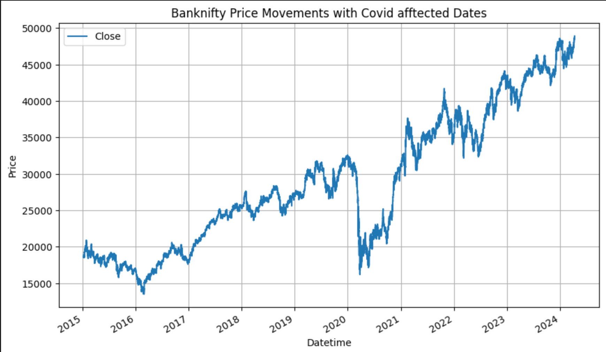
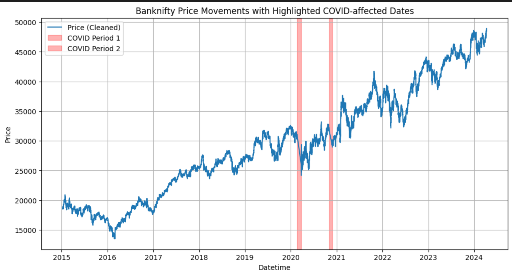
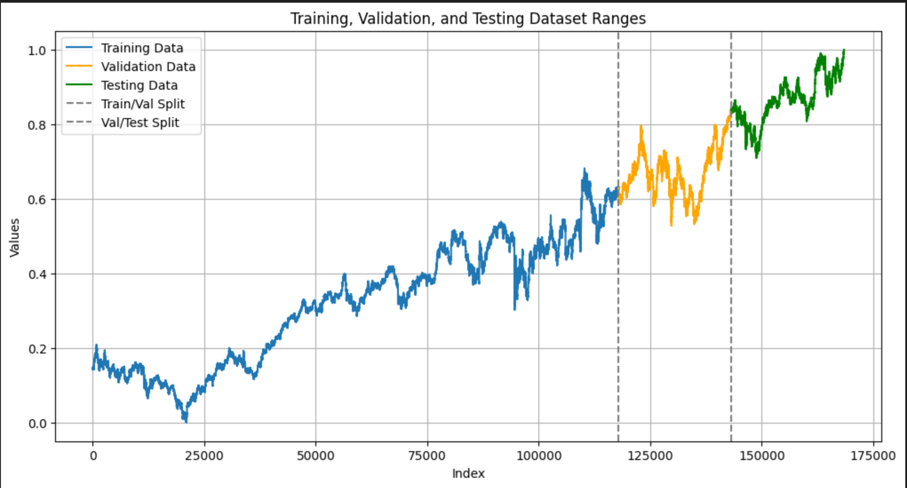
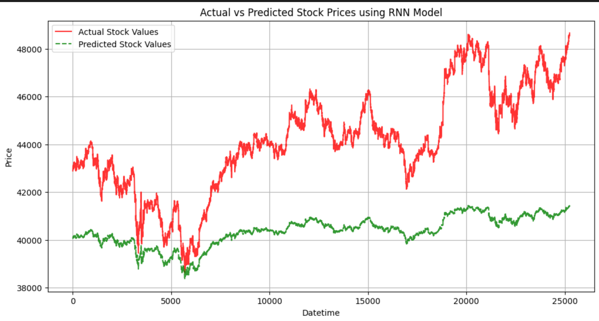
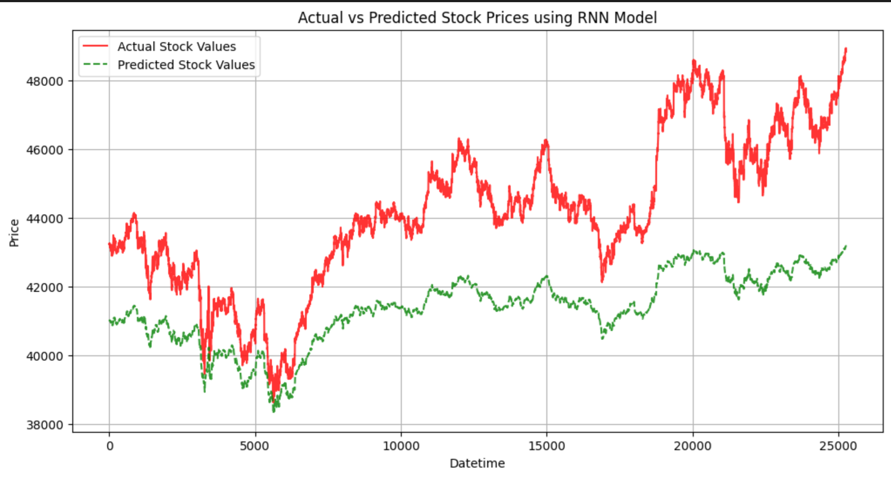
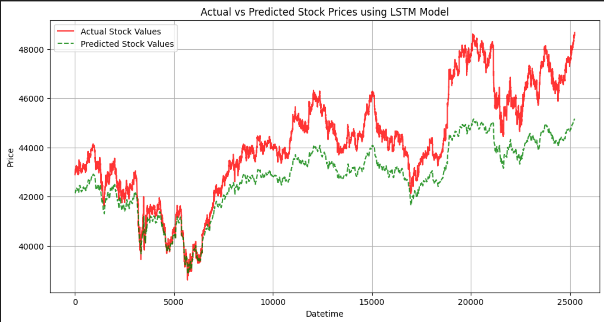
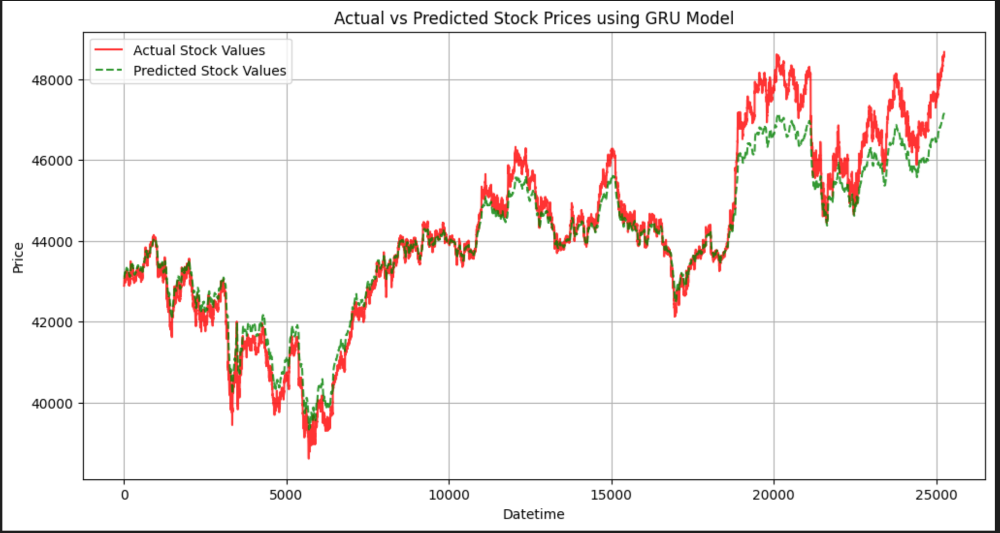

# 📈 Stock Price Prediction using RNN, GRU & LSTM

This project focuses on predicting short-term price movements of **Bank Nifty** using deep learning models—RNN, GRU, and LSTM—applied on **5-minute interval stock market data**. The models are trained to forecast future price trends based on historical sequences, enabling more informed trading decisions.

---

## 🎯 Objective

- Analyze short-term Bank Nifty stock trends using deep learning techniques  
- Filter relevant date ranges (excluding COVID-impact noise)  
- Apply and compare sequence models: Simple RNN, LSTM, and GRU  
- Evaluate model performance based on actual vs predicted prices

---

## 📁 Dataset

- **Source**: 5-minute interval Bank Nifty dataset  
- **Filtered**: Retained data from the COVID-affected period to focus on volatile and significant trends

---

## 🛠️ Workflow

### 1. 📊 Data Loading and Visualization

The raw Bank Nifty data was loaded, cleaned, and plotted to observe its price trends over time.

 

|:--:|
| *Figure 1: Raw 5-minute interval Bank Nifty stock prices over time.* |

---

### 2. 🧹 Filtering COVID Period

A critical step involved identifying and extracting data specifically from the COVID-affected market window to train models on volatile periods.

 

---

### 3. ✂️ Preprocessing and Train-Test Split

- Normalized stock prices using MinMax scaling  
- Windowed the data into sequences for time-series input  
- Split into training and testing sets (80:20 ratio)

 

---

### 4. 🔁 Simple RNN Model

- Built a simple Recurrent Neural Network (RNN)  
- Tuned hyperparameters using trial-and-error  
- Trained and tested on preprocessed sequences

|  |

|:--:|
| *Figure 2: RNN model's predicted vs actual prices.* |
---

### 5. ⚙️ Hyperparameter Tuning for RNN

- Adjusted units, epochs, and learning rates  
- Retrained RNN after finding the best configuration

|  |

---

### 6. 🔁 LSTM Model (Long Short-Term Memory)

- Implemented LSTM for better sequence retention  
- Compared results with the RNN model

|  |

|:--:|
| *Figure 3: LSTM model predictions showing better trend tracking.* |

---

### 7. 🔁 GRU Model (Gated Recurrent Unit)

- Implemented GRU to balance simplicity and performance  
- Showed competitive results against LSTM

|  |

|:--:|
| *Figure 4: GRU model performance on test data.* |

---

---

## ✅ Conclusion

- 📉 The LSTM and GRU models outperformed the basic RNN in tracking patterns  
- 📌 GRU achieved near-LSTM performance with fewer parameters  
- 🔁 Sequence modeling effectively captures temporal dependencies in stock data  
- 🧠 Deep learning can aid short-term stock movement prediction, but performance depends heavily on input windows and market noise

---

📝 All code and analysis are documented in the Jupyter notebook: `DL_Assignment3_RNN_v5.ipynb`.

📂 All visualizations are available in the `Plots/` folder.
